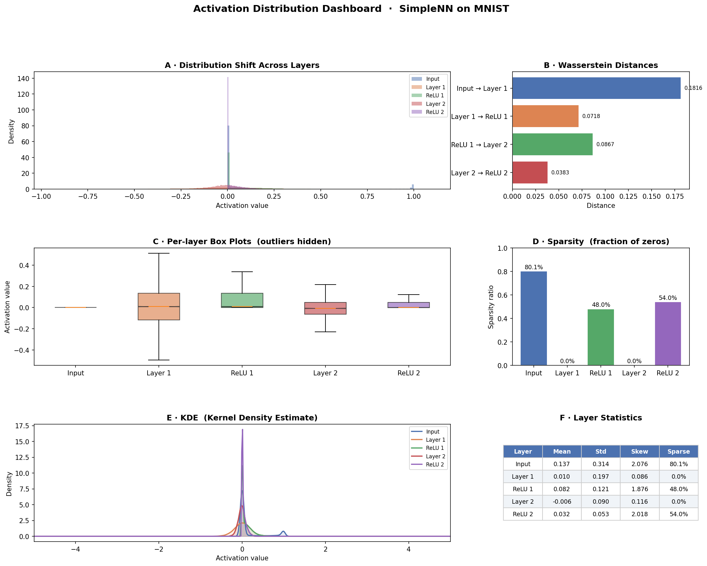

# Layer-wise Distribution Analysis using Wasserstein Distance

## 📌 Overview
This project analyzes how data distributions change across neural network layers using Wasserstein distance.

## ⚙️ Method
- Built a neural network using PyTorch  
- Extracted layer-wise activations  
- Computed Wasserstein distance between layers  
- Performed statistical and sparsity analysis  

## 📊 Output

## 🛠️ Tech Stack
Python, PyTorch, NumPy, Matplotlib, SciPy  

## 📎 Author
Aditya Jha (CSE, VNIT Nagpur)
